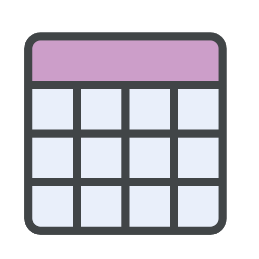

<a id="readme-top"></a>

[![Contributors][contributors-shield]][contributors-url]
[![Forks][forks-shield]][forks-url]
[![Stargazers][stars-shield]][stars-url]
[![Issues][issues-shield]][issues-url]
[![MIT License][license-shield]][license-url]
[![LinkedIn][linkedin-shield]][linkedin-url]

<br />
<div align="center">
    <a href="https://github.com/quiksadev/quiksa-table">
        
    </a>
    <h3 align="center">Quiksa Table</h3>
</div>

<details>
  <summary>Links</summary>
  <ol>
    <li><a href="#about-the-project">About The Project</a></li>
    <li><a href="#installation">Installation</a></li>
    <li><a href="#usage">Usage</a></li>
    <li><a href="#customization">Customization</a></li>
    <li><a href="#examples">Examples</a></li>
    <li><a href="#theming">Theming</a></li>
    <li><a href="#server-side-data-fetching">Server-Side Data Fetching</a></li>
    <li><a href="#contributing">Contributing</a></li>
    <li><a href="#contact">Contact</a></li>
  </ol>
</details>

## About The Project

[![Product Name Screen Shot][product-screenshot]](https://github.com/quiksadev/quiksa-table) 

QuiksaTable is a highly customizable and responsive table component designed for Next.js projects. Built with React and Tailwind CSS, it offers features like sorting, filtering, pagination, row selection, and inline editing to provide a seamless data management experience.

## Features

- **Responsive Design**: Ensures the table looks great on all screen sizes.
- **Sorting**: Clickable headers to sort data ascending or descending.
- **Filtering**: Global and column-specific filtering options.
- **Pagination**: Navigate through data with ease.
- **Row Selection**: Select individual or all rows.
- **Inline Editing**: Edit cell data directly within the table.
- **Custom Actions**: Add custom action buttons for each row.
- **Theming**: Easily customize the table's appearance using Tailwind CSS.

## Installation

To install QuiksaTable, you can use npm or yarn:

```bash
# Using npm
npm i quiksa-table

# Using yarn
yarn add quiksa-table
```
<p align="right">(<a href="#readme-top">back to top</a>)</p>

## Usage
### Basic Usage
Here's how you can integrate QuiksaTable into your Next.js project:

```tsx
import React from "react";
import QuiksaTable from "quiksatable";

interface Page {
  id: number;
  name: string;
  author: string;
  slug: string;
  status: string;
  created_at: string;
}

const columns = [
  {
    header: "Name",
    accessor: "name",
    filterable: true,
    sortable: true,
    editable: true,
    editorType: "text",
  },
  {
    header: "Author",
    accessor: "author",
    filterable: true,
    sortable: true,
    editable: false,
  },
  {
    header: "Slug",
    accessor: "slug",
    filterable: true,
    sortable: true,
    editable: false,
  },
  {
    header: "Status",
    accessor: "status",
    filterable: true,
    sortable: true,
    editable: true,
    editorType: "select",
    editorOptions: [
      { label: "Published", value: "published" },
      { label: "Draft", value: "draft" },
      { label: "Inactive", value: "inactive" },
    ],
    formatter: (value: string) => {
      const statusColors: Record<string, string> = {
        published: "bg-green-100 text-green-800",
        draft: "bg-yellow-100 text-yellow-800",
        inactive: "bg-red-100 text-red-800",
      };
      return (
        <span className={`px-2 inline-flex text-xs leading-5 font-semibold rounded-full ${statusColors[value]}`}>
          {value}
        </span>
      );
    },
  },
  {
    header: "Created",
    accessor: "created_at",
    filterable: true,
    sortable: true,
  },
];

const actions = [
  {
    label: "Show",
    onClick: (row: Page) => alert(`Showing details for ${row.name}`),
    className: "text-indigo-600 hover:text-indigo-900 focus:outline-none focus:underline",
  },
];

const data: Page[] = [
  {
    id: 1,
    name: "Home",
    author: "John Doe",
    slug: "home",
    status: "published",
    created_at: "2023-01-01",
  },
  {
    id: 2,
    name: "About",
    author: "Jane Smith",
    slug: "about",
    status: "draft",
    created_at: "2023-02-15",
  },
  {
    id: 3,
    name: "Contact",
    author: "Mike Johnson",
    slug: "contact",
    status: "inactive",
    created_at: "2023-03-10",
  },
];

const fetchData = async (params: any) => {
  // Replace with your data fetching logic
  return new Promise<{ data: Page[]; totalPages: number }>((resolve) => {
    setTimeout(() => {
      resolve({ data, totalPages: 1 });
    }, 1000);
  });
};

const handleCellUpdate = async (rowKeyValue: number, columnKey: keyof Page, newValue: any) => {
  // Handle cell update logic
  console.log(`Updating row ${rowKeyValue}, column ${columnKey} with value ${newValue}`);
};

const PageTable: React.FC = () => {
  return (
    <QuiksaTable<Page, "id">
      columns={columns}
      data={data}
      fetchData={fetchData}
      sortable
      filterable
      pageable
      itemsPerPage={5}
      initialSortConfig={{ key: "name", direction: "ascending" }}
      actions={actions}
      rowKey="id"
      selectable
      onSelectionChange={(isAllSelected, selectedRowKeys) => {
        console.log("All Selected:", isAllSelected);
        console.log("Selected Rows:", Array.from(selectedRowKeys));
      }}
      onCellUpdate={handleCellUpdate}
    />
  );
};

export default PageTable;

```

## Customization
You can customize the table's appearance and behavior using the theme prop and by modifying the columns configuration.

### Props

QuiksaTable accepts the following props:

| Prop                   | Type                                                                 | Description                                                                                         |
| ---------------------- | -------------------------------------------------------------------- | --------------------------------------------------------------------------------------------------- |
| `columns`              | `Column<T>[]`                                                        | Array of column definitions.                                                                        |
| `data`                 | `T[]`                                                                | Data to be displayed in the table.                                                                  |
| `fetchData`            | `(params: any) => Promise<any>`                                      | Function to fetch data for server-side rendering.                                                  |
| `sortable`             | `boolean`                                                            | Enables or disables sorting functionality.                                                           |
| `filterable`           | `boolean`                                                            | Enables or disables filtering functionality.                                                         |
| `pageable`             | `boolean`                                                            | Enables or disables pagination.                                                                      |
| `itemsPerPage`         | `number`                                                             | Number of items to display per page.                                                                 |
| `initialSortConfig`    | `SortConfig<T> \| null`                                               | Initial sort configuration.                                                                          |
| `actions`              | `Action<T>[]`                                                        | Array of action buttons to display in each row.                                                     |
| `customHeaderComponent`| `React.ReactNode`                                                    | Custom component to display in the table header.                                                    |
| `rowKey`               | `K`                                                                  | Unique key to identify each row.                                                                     |
| `selectable`           | `boolean`                                                            | Enables or disables row selection.                                                                   |
| `onSelectionChange`    | `(isAllSelected: boolean, selectedRowKeys: Set<T[K]>) => void`      | Callback function when row selection changes.                                                       |
| `onCellUpdate`         | `(rowKeyValue: T[K], columnKey: keyof T, newValue: any) => Promise<void>` | Callback function when a cell is updated.                                                         |
| `theme`                | `QuiksaTableTheme`                                                   | Custom theme configuration for the table.                                                             |

### Column Definitions

Each column can have the following properties:

| Property        | Type                                                         | Description                                                                                         |
| --------------- | ------------------------------------------------------------ | --------------------------------------------------------------------------------------------------- |
| `header`        | `string`                                                     | Display name of the column.                                                                         |
| `accessor`      | `K`                                                          | Key to access the corresponding data in the row.                                                   |
| `filterable`    | `boolean`                                                    | Enables or disables filtering for the column.                                                       |
| `sortable`      | `boolean`                                                    | Enables or disables sorting for the column.                                                         |
| `editable`      | `boolean`                                                    | Enables or disables inline editing for the column.                                                 |
| `editorType`    | `EditorType`                                                 | Type of editor to use for inline editing (`text`, `number`, `select`, `date`).                     |
| `editorOptions` | `Array<{ label: string; value: any }>`                       | Options for select editors.                                                                         |
| `formatter`     | `(value: any) => React.ReactNode`                            | Function to format the display of the cell's value.                                                |
| `filterType`    | `FilterType`                                                 | Type of filter to use (`text`, `number`, `select`, `date`).                                        |
| `filterOptions` | `Array<{ label: string; value: any }>`                       | Options for select filters.                                                                         |

## Examples

### Inline Editing

Enable inline editing for specific columns by setting ``editable`` to ``true`` and specifying the ``editorType``.

```tsx
const columns = [
  {
    header: "Name",
    accessor: "name",
    editable: true,
    editorType: "text",
  },
  // ...other columns
];
```

### Custom Actions

Add custom action buttons to each row.

```tsx
const actions = [
  {
    label: "Show",
    onClick: (row: Page) => alert(`Showing details for ${row.name}`),
    className: "text-indigo-600 hover:text-indigo-900 focus:outline-none focus:underline",
  },
];
```

## Theming
Customize the table's appearance using the ``theme`` prop. You can override default styles by providing your own styles.

- Ensure you have Tailwind CSS set up in your Next.js project. If not, follow the <a href="https://tailwindcss.com/docs/guides/nextjs">official Tailwind CSS installation guide<a/>.

Customize the table's appearance using the theme prop. You can override default styles by providing your own styles.

```tsx
const customTheme: QuiksaTableTheme = {
  tableClassName: "min-w-full divide-y divide-gray-200",
  headerClassName: "bg-indigo-50",
  // ...other theme properties
};

<QuiksaTable
  // ...other props
  theme={customTheme}
/>
```

## Server-Side Data Fetching
For large datasets, utilize server-side data fetching by providing the ``fetchData`` prop.

```tsx
const fetchData = async (params: any) => {
  const response = await fetch(`/api/data?page=${params.page}&limit=${params.itemsPerPage}`);
  const result = await response.json();
  return { data: result.data, totalPages: result.totalPages };
};

<QuiksaTable
  // ...other props
  fetchData={fetchData}
/>
```

## Contributing
Contributions are welcome! Please follow these steps:
- Fork the repository.
- Create a new branch (``git checkout -b feature/YourFeature``).
- Commit your changes (``git commit -am 'Add some feature'``).
- Push to the branch (``git push origin feature/YourFeature``).
- Open a pull request.

## Contact

Alper Dursun - [@github](https://github.com/alperdrsnn) - alper@defenzysoft.com

<p align="right">(<a href="#readme-top">back to top</a>)</p>

[contributors-shield]: https://img.shields.io/github/contributors/quiksadev/quiksa-table?style=for-the-badge
[contributors-url]: https://github.com/quiksadev/quiksa-table/graphs/contributors
[forks-shield]: https://img.shields.io/github/forks/quiksadev/quiksa-table?style=for-the-badge
[forks-url]: https://github.com/quiksadev/Best-README-Template/network/members
[stars-shield]: https://img.shields.io/github/stars/quiksadev/quiksa-table?style=for-the-badge
[stars-url]: https://github.com/quiksadev/Best-README-Template/stargazers
[issues-shield]: https://img.shields.io/github/issues/quiksadev/quiksa-table?style=for-the-badge
[issues-url]: https://github.com/quiksadev/Best-README-Template/issues
[license-shield]: https://img.shields.io/github/license/quiksadev/quiksa-table?style=for-the-badge
[license-url]: https://github.com/quiksadev/quiksa-table/blob/master/LICENSE
[linkedin-shield]: https://img.shields.io/badge/-LinkedIn-black.svg?style=for-the-badge&logo=linkedin&colorB=555
[linkedin-url]: https://www.linkedin.com/company/quiksa
[product-screenshot]: images/product-screenshot.png
